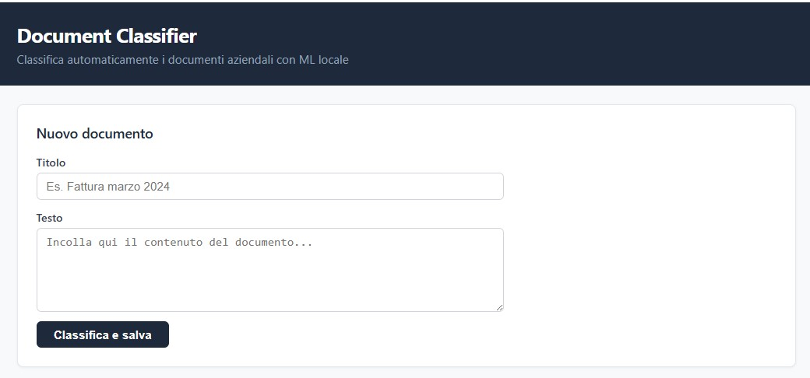
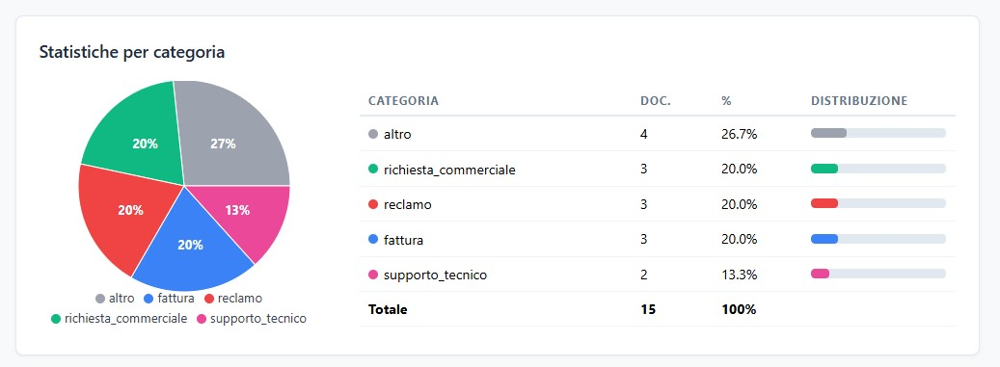
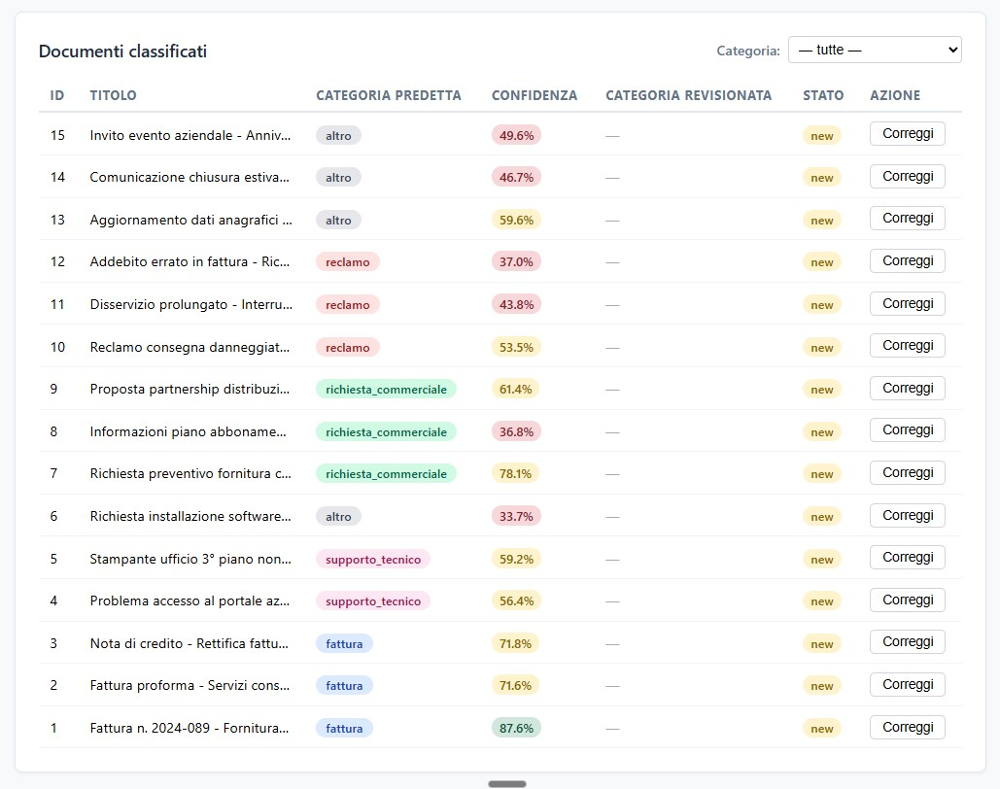

# Document Classifier

A full-stack web app that automatically classifies Italian business documents using **local machine learning** (scikit-learn). No external APIs, no cloud ML — everything runs on your own infrastructure.

**Live demo:** [document-classifier-6hyi.vercel.app](https://document-classifier-6hyi.vercel.app) · Backend on Railway · Frontend on Vercel

---

## Screenshots





---

## Tech Stack

| Layer | Technology |
|---|---|
| Frontend | React 18 + Vite 5 |
| Backend | Python 3.11 + FastAPI |
| Database | SQLite + SQLModel |
| ML | scikit-learn — TF-IDF + Logistic Regression |

---

## Features

- **Auto-classification** — instant category prediction with confidence score (color-coded green/yellow/red)
- **Manual review** — correct any prediction inline; reviewed rows are highlighted
- **Statistics dashboard** — animated pie chart + distribution table
- **15 pre-loaded demo documents** — dashboard is populated on first visit
- **REST API** — documented via Swagger UI at `/docs`

---

## Supported Categories

| Category | Description |
|---|---|
| `fattura` | Invoices, credit notes, payment reminders |
| `supporto_tecnico` | IT support requests, fault reports |
| `richiesta_commerciale` | Quote requests, commercial inquiries |
| `reclamo` | Complaints, refund requests |
| `altro` | General communications |

Trained on 125 labeled Italian-language examples — ~92% accuracy on test set.

---

## Getting Started

**Prerequisites:** Python 3.10+, Node.js 18+

```bash
# 1. Backend
cd backend
cp .env.example .env          # default uses SQLite, no setup needed
python -m venv .venv
source .venv/Scripts/activate # macOS/Linux: source .venv/bin/activate
pip install -r requirements.txt
python ml/training.py         # train the ML model
python seed.py                # optional: load 15 example documents

# 2. Frontend
cd frontend && npm install

# 3. Start both
bash start.sh    # macOS / Linux / Git Bash
start.bat        # Windows CMD
```

| Service | URL |
|---|---|
| Frontend | http://localhost:5173 |
| API docs | http://localhost:8000/docs |

---

## API

| Method | Endpoint | Description |
|---|---|---|
| `POST` | `/documents/classify` | Classify and save a document |
| `GET` | `/documents` | List documents (`?category=fattura`) |
| `PATCH` | `/documents/{id}/review` | Correct a predicted category |
| `GET` | `/stats/categories` | Document count per category |
| `GET` | `/health` | Health check |

---

## License

MIT
